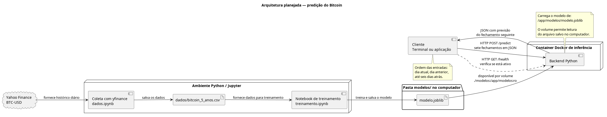
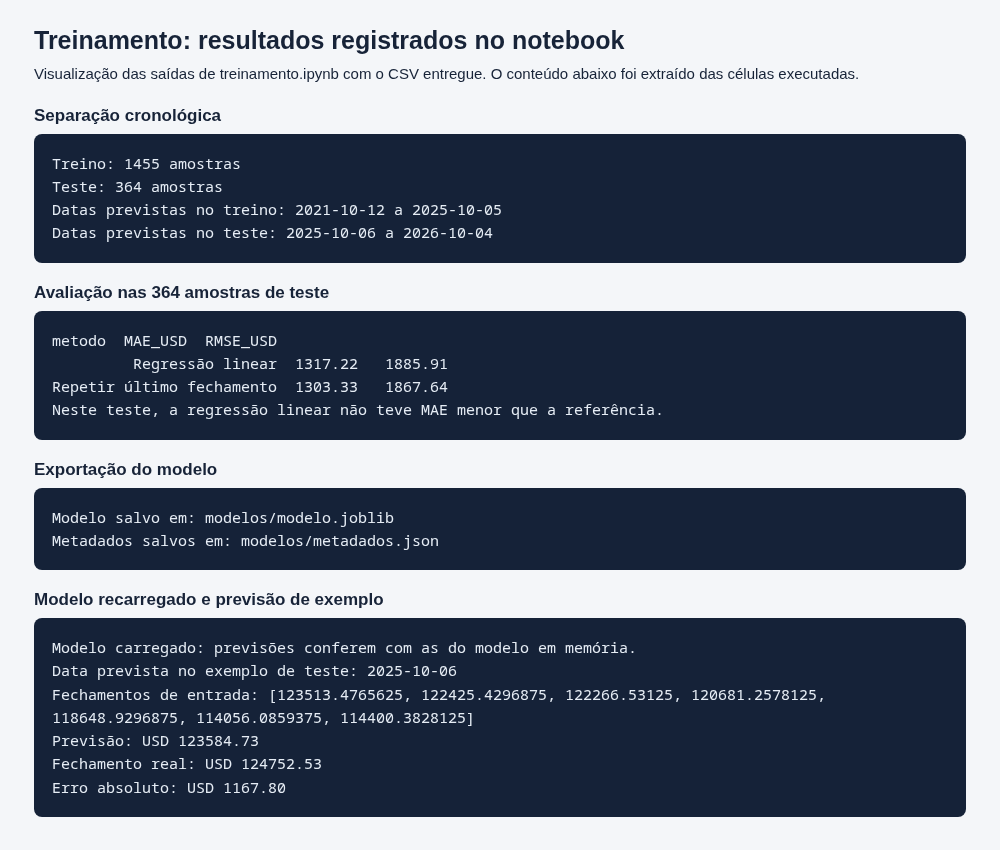
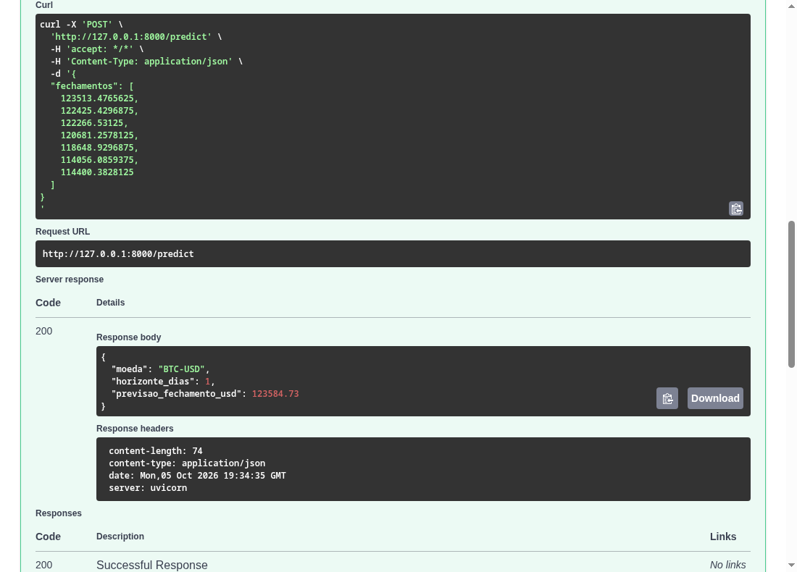
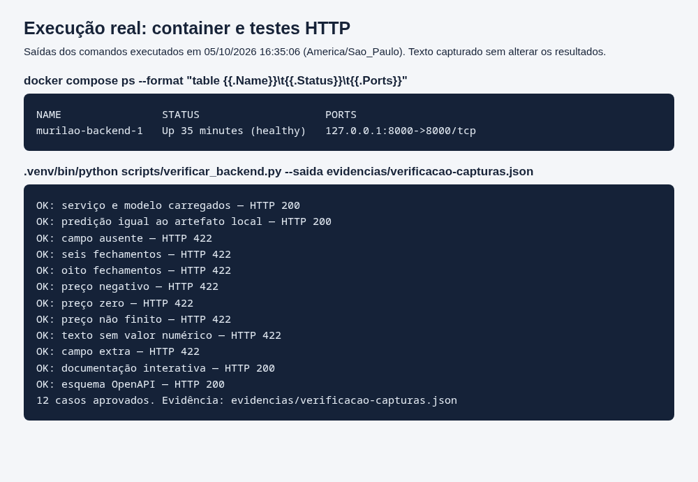

### KAIAN SANTOS MOURA - ENGENHARIA DE COMPUTAÇÃO - T16

## ATIVIDADE PONDERADA: MODELO DE PREDIÇÃO COM DOCKER

## DADOS

Resolvi pegar os dados históricos do Bitcoin pelo Yahoo Finance.

https://finance.yahoo.com/quote/BTC-USD/history/

Resolvi usar 5 anos de dados porque assim teria um histórico maior para treinamento e teste, ainda mais levando em consideração que Bitcoin é bem volátil.

nesta vou usar bastante o ChatGPT como ajuda para me organizar oprincipalemnte. um dos usos que estou fazendo é "qual é o meu próximo passo?", assim conseguia dividir a tarefa em partes menores e seguir uma linha de raciocínio sem me perder.

também solicitei ajuda do ChatGPT para gerar o CSV usando a biblioteca yfinance com os dados do Yahoo Finance.

Na geração do CSV foi excluído o dia atual da coleta, 05/10, porque ainda não tinha acontecido o fechamento diário e o valor ainda poderia mudar.

No total ficaram 1826 registros, começando em 05/10/2021 e terminando em 04/10/2026.

O CSV foi colocado na pasta dados.

Na extração não foram encontrados valores ausentes ou datas duplicadas, então não precisei fazer uma limpeza específica para esses casos.

## DIAGRAMA INICIAL

Para fazer o diagrama pensei primeiro em uma estrutura simples envolvendo os dados, CSV, notebook de treinamento, modelo salvo, backend e cliente.

DADOS SEM ESXTRAÇÃO -> CSV -> NOTEBOOK DO TREINAMENTO -> (Salvamento) -> Arquivo do modelo -> (Disponibilidade por volume) -----------------------------------> backend python
                                                   ^     |
Cliente terminal ou aplicação -> Solicita predição |     |
                      ^-----------------------------------
Inicialmente mandei essa ideia para o ChatGPT e pedi ajuda para gerar um código para usar no dbdiagram.

conversando com o ChatGPT, percebi que o dbdiagram não era a melhor ferramenta porque a atividade estava pedindo um UML de componentes e fluxo. A sugestão foi usar PlantUML que realmente fazia sentido

Então o UML ficou assim:

## TREINAMENTO

No treinamento faço a leitura do CSV usando principalmente as colunas Date e Close, mantendo os registros em ordem cronológica.

Meu objetivo foi utilizar os 7 fechamentos anteriores para tentar prever o fechamento do próximo dia.

O X guarda os sete preços conhecidos e o Y guarda o fechamento seguinte, que é a resposta esperada.

estava tendo dificuldadses para entender e com ajuda do ChatGPT consegui entender melhor como deveria montar essa janela e porque algumas linhas precisavam ser removidas.

As seis primeiras linhas não possuem os sete dias de histórico completo e a última não possui um fechamento seguinte para servir de resposta. Por isso, dos 1826 registros sobraram 1819 amostras.

Separei 1455 amostras para treinamento e 364 para teste.

com isso useei os dados mais antigos para treinamento e os mais recentes para test. também usei aIA para entender melhor porque eu deveria manter essa ordem ao invés de simplesmente misturar os dados.

Se eu misturasse tudo, poderia acabar treinando com informações posteriores às usadas no teste, o que deixaria a avaliação menos parecida com uma situação real.

Para a primeira versão escolhi regressão linear porque queria começar com um modelo simples e conseguir acompanhar o fluxo inteiro da atividade.

O modelo teve MAE de US$ 1.317,22.

Também comparei com uma referência simples, q considera q o próximo fechamento será igual ao último fechamento conhecido. Essa referência teve MAE de US$ 1.303,33.

Então nesse teste a regressão ficou um pouco pior que a ref. Por causa disso não posso afirmar que ela melhorou a previsão.

O modelo foi salvo em modelos/modelo.joblib.

Depois, com ajuda do ChatGPT, conferi se o modelo carregado desse arquivo produzia as mesmas previsões que ele produzia antes de ser salvo.

Também foi registradas informações importantes em modelos/metadados.json.

## COMO A IA ME AJUDOU NO TREINAMENTO

Além de ajudar na organização das etapas, usei o ChatGPT para entender melhor a diferença entre as entradas e o alvo do modelo, como criar a janela de sete dias e pq era importante separar os dados cronologicamente.

Tbm usei para revisar partes do código e entender os resultados que estava obtendo.

Mesmo usando IA como suporte, executei os notebooks, conferi os resultados e fui testando cada etapa do projeto.

## BACKEND E DOCKER

fiz um backend em Python usando FastAPI.

Quando o serviço inicia ele carrega o modelo salvo em modelos/modelo.joblib e fica disponível para receber requisições.

O backend possui duas rotas principais.

GET /health serve para verificar se o serviço está ativo e se o modelo foi carregado.

POST /predict recebe sete fechamentos e retorna uma estimativa do fechamento do próximo dia.

O backend ficou em backend/main.py.

Também criei Dockerfile, requirements-backend.txt e compose.yaml.

Pra disponibilizar o modelo dentro do container usei um volume ligando a pasta modelos do computador ao caminho /app/modelos dentro do container.

Deixei esse volume como somente leitura porque o backend só precisa carregar o modelo.

Nessa etapa tbm usei bastante o ChatGPT para entender e corrigir a configuração do Docker, principalmente a comunicação entre o arquivo do modelo e o backend dentro do container.

tmb usei o gpt pra criar uma documentação interativa bem básica pra ficar melhor visualmente nso prints

## justificativa

Usei o yfinance para baixar o histórico do Bitcoin direto pelo notebook. O pandas usei para ler o CSV, organizar as datas e montar as entradas com os sete fechamentos. Para o modelo escolhi o scikit-learn porque nele consegui fazer a regressão linear e também calcular as métricas para avaliar o resultado.

Depois usei o joblib para salvar o modelo treinado e conseguir carregar ele novamente no backend. Para fazer o backend escolhi FastAPI, nele criei as rotas, validações das entradas e também consegui ter a documentação da API.

Nessa parte também usei bastante o ChatGPT para entender qual biblioteca usar em cada parte e me ajudar a montar e corrigir o código quando aparecia algum problema.

## testar curl

docker compose up -d --build

Depois envio os sete fechamentos que estão no arquivo de exemplo:

curl -X POST http://localhost:8000/predict 
-H 'Content-Type: application/json' 
--data-binary @exemplos/predicao.json

## INTEGRAÇÃO E TESTES

Para construir e iniciar o projeto usei:

docker compose up -d --build

Depois conferi o estado com:

docker compose ps

O container ficou no estado healthy.

Primeiro testei GET /health e recebi HTTP 200, confirmando que o backend estava funcionando e que o modelo tinha sido carregado.

Depois fiz uma requisição para POST /predict enviando sete fechamentos.

A resposta retornou HTTP 200 com:

{"moeda":"BTC-USD","horizonte_dias":1,"previsao_fechamento_usd":123584.73}

Isso mostraa que o modelo treinado conseguiu ser carregado dentro do container e usado pelo backend para realizar uma previsão.

Tabm fiz testes com entradas inválidas.

Com ajuda do ChatGPT pensei em alguns casos que poderiam dar problema, como campo ausente, seis fechamentos, oito fechamentos, preço negativo, valor não finito e texto no lugar de número.

Esses casos foram rejeitados com HTTP 422.

Tambemm comparei previsão feita pelo modelo dentro do container com a previsão do mesmo arquivo carregado fora dele. Os resultados foram iguais.

Para não precisar repetir todos os testes manualmente, também criei o arquivo scripts/verificar_backend.py.

Na execução final foram feitos 12 testes envolvendo health, predição, entradas inválidas e documentação da API.

Todos passaram.

## DIFICULDADES E ALTERAÇÕES

Uma das primeiras dificuldades foi o diagrama.

Inicialmente pensei em usar dbdiagram, mas com ajuda do ChatGPT percebi que estava confundindo um diagrama de banco com o UML de componentes pedido na atividade.

Então mudei para PlantUML.

Outra dificuldade foi entender porque 1826 registros estavam virando 1819 amostras.

Com ajuda da IA consegui identificar que eram seis linhas iniciais sem histórico suficiente e uma linha final sem um próximo valor para servir como resposta.

Durante a execução dos notebooks também apareceram alguns arquivos kernel-ipc- que eu nunca tinha visto.

Pesquisei e perguntei para a IA o que eram esses arquivos e descobri que eram arquivos temporários relacionados à comunicação do kernel do Jupyter. Depois disso removi eles.

Também tive um problema com a versão do Python.

A imagem inicial do Docker estava usando Python 3.14.8 enquanto meu treinamento estava usando Python 3.14.7.

Com ajuda do ChatGPT identifiquei essa diferença e alterei a imagem para Python 3.14.7 para deixar os ambientes mais alinhados.

A API já estava funcionando anteriormente, mas preferi manter as versões iguais para reduzir diferenças entre os ambientes.

## COMO USEI IA NO PROJETO

O ChatGPT foi usado como ferramenta de apoio durante praticamente todas as etapas.

usei principalmente p organizar os próximos passos da atividade, e com iss entender conceitos que eu ainda tava em duvid, e tambem gerar uma primeira versão de alguns códigos, encontrar problemas, revisar configurações e sugerir formas de testar a aplicação.

Algumas das coisas que fiz com ajuda da IA foram gerar o CSV utilizando yfinance, transformar minha ideia inicial em UML, entender a janela temporal de sete dias, organizar o treinamento, corrigir configurações do Docker, pensar em testes para a API e entender alguns erros encontrados durante o desenvolvimento.

Eu fui executando as soluções sugeridas e validando os resultados durante o projeto. Quando alguma coisa não funcionava como esperado, voltava para investigar o problema e fazer os ajustes.

## COMO EXECUTAR O PROJETO

Para executar com o modelo já treinado é necessário ter Git e Docker com Docker Compose instalados.

git clone https://github.com/Kaian-Moura/MurioPiece.git

cd MurioPiece

docker compose up -d --build

docker compose ps

Para consultar os logs:

docker compose logs backend

Para parar o serviço:

docker compose down

lpra repetir o treinamento é necessário instalar as dependências de requirements-notebooks.txt e executar treinamento.ipynb.

O notebook utiliza dados/bitcoin_5_anos.csv e gera novamente modelos/modelo.joblib e modelos/metadados.json.

Caso o backend esteja funcionando enquanto um novo modelo é treinado, é necessário reiniciar o serviço:

docker compose restart backend

## LIMITAÇÕES

Oeste modelo utiliza somente os preços de fechamento dos sete dias anteriores e tenta prever apenas um dia à frente.

Ele não considera notícias ou outros acontecimentos que podem influenciar bastante o Bitcoin(como aquele caso daquela criptmoeda que foi invadida e perdeuu mjito valor).

Aléam disso, no teste realizado, a regressão linear teve um erro um pouco maior que a referência simples.

metricas:

MAE de US$ 1.317,22 e RMSE de US$ 1.885,91.

A referência simples, que repete o último fechamento conhecido, teve MAE de US$ 1.303,33 e RMSE de US$ 1.867,64.

VALEU MURILÃO

